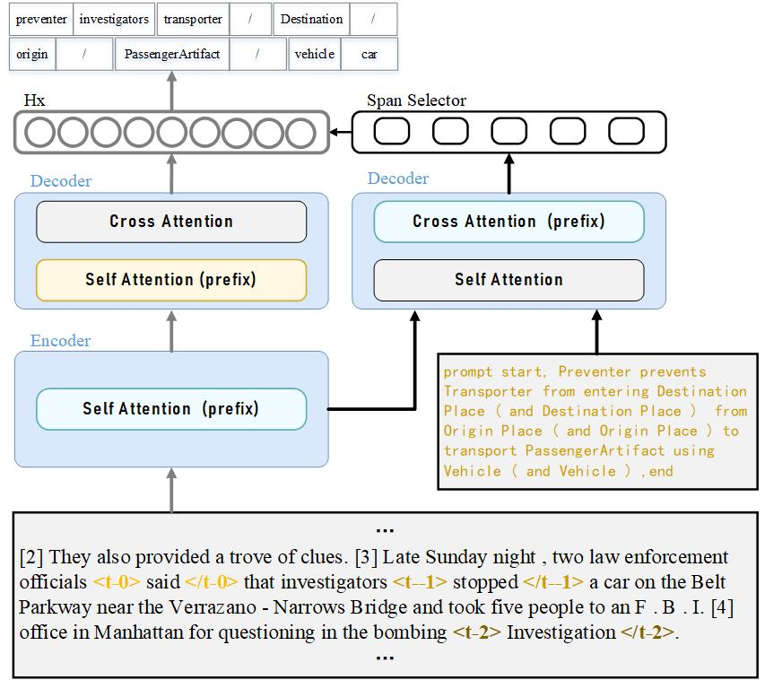

# CsgoEAE (**C**o and **S**tructure aware **G**enerative-based **O**f **E**vent **A**rgument **E**xtraction)
This is the implementation of the paper [Co and Structure-aware for Document-level Event Argument Extraction]


## Quick links

* [Overview](#overview)
* [Preparation](#preparation)
  * [Environment](#environment)
  * [Data](#data)
* [Run the model](#run-lm-bff)
  * [Quick start](#quick-start)
* [Citation](#citation)

## Overview
<p align="center" width="100%">

</p>
In this work we present CsgoEAE for document-level event argument extraction. We formulate highlights as follow.

- Multiple-event cues aid in enhancing the model's performance when dealing with complex event relationships.
- Constructing structured information by limiting the receptive field can alleviate the interference of redundant information.
- The prefix-based approach can integrate various auxiliary perceptual information.


## Preparation

### Environment
To run our code, please install all the dependency packages by using the following command:

```
pip install -r requirements.txt
```
All experiments run with BART_Large, You can install from [Huggingface](https://huggingface.co/facebook/bart-large).

### Data
We conduct experiments on three common datasets: RAMS, WIKIEVENTS and MLEE.

## Run the model

### Quick start
You could simply run PAIE with following commands: 
```bash
bash ./scripts/train_{mlee|rams|wikievent}_large.sh
```
Folders will be created automatically to store: 

1. Subfolder `checkpoint`: model parameters with best dev set result
2. File `log.txt`: recording hyper-parameters, training process and evaluation result
3. File `best_dev_results.log`/`best_test_related_results.log`: showing prediction results of checkpoints on every sample in dev/test set.

You could see hyperparameter setting in `./scripts/train_[dataset].sh` and `config_parser.py`. We give most of hyperparameters a brief explanation in `config_parser.py`.


## Citation
Please cite our paper if you use CsgoEAE in your work:
```bibtex

```
